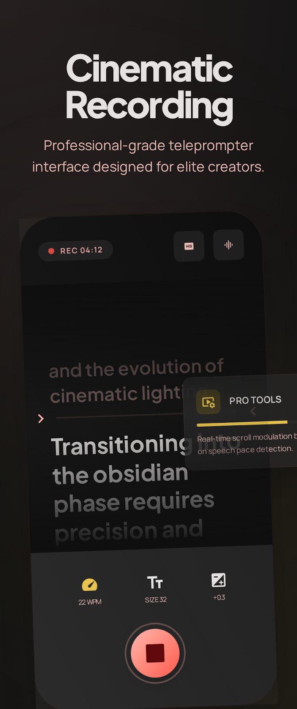
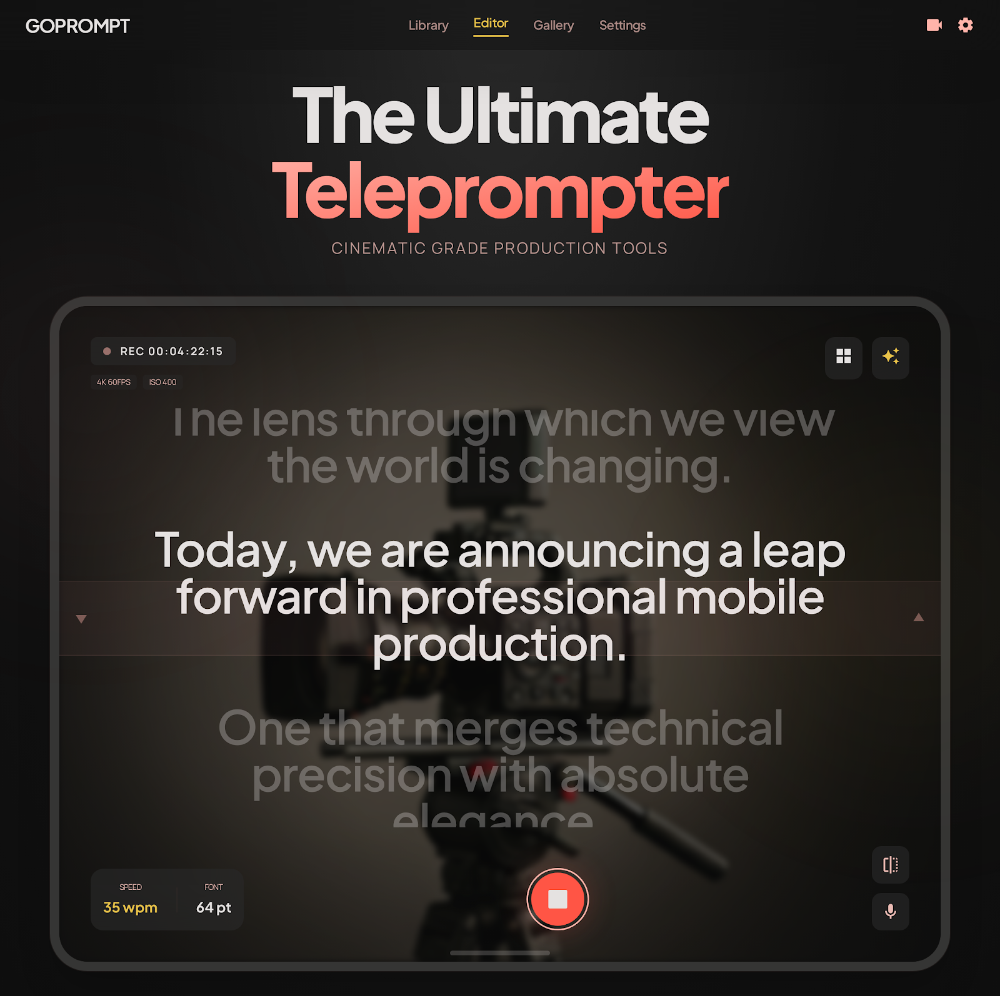
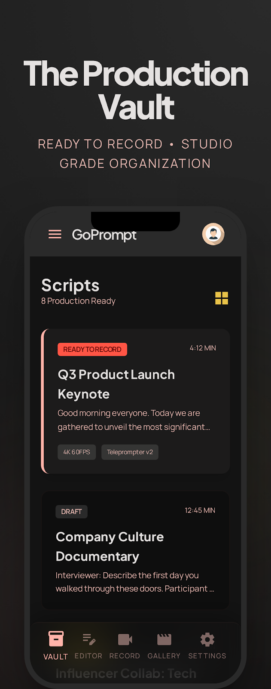
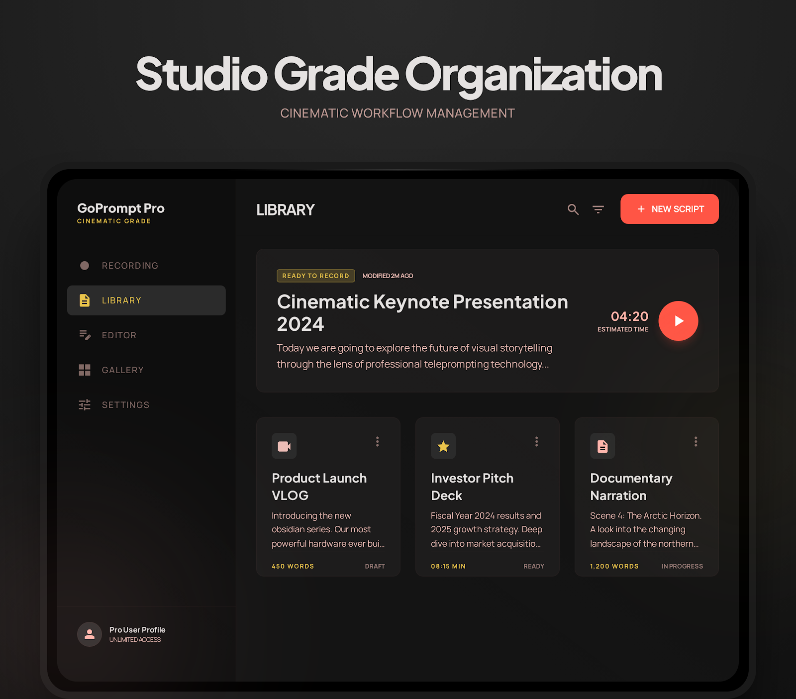
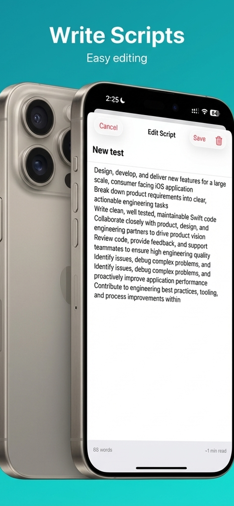
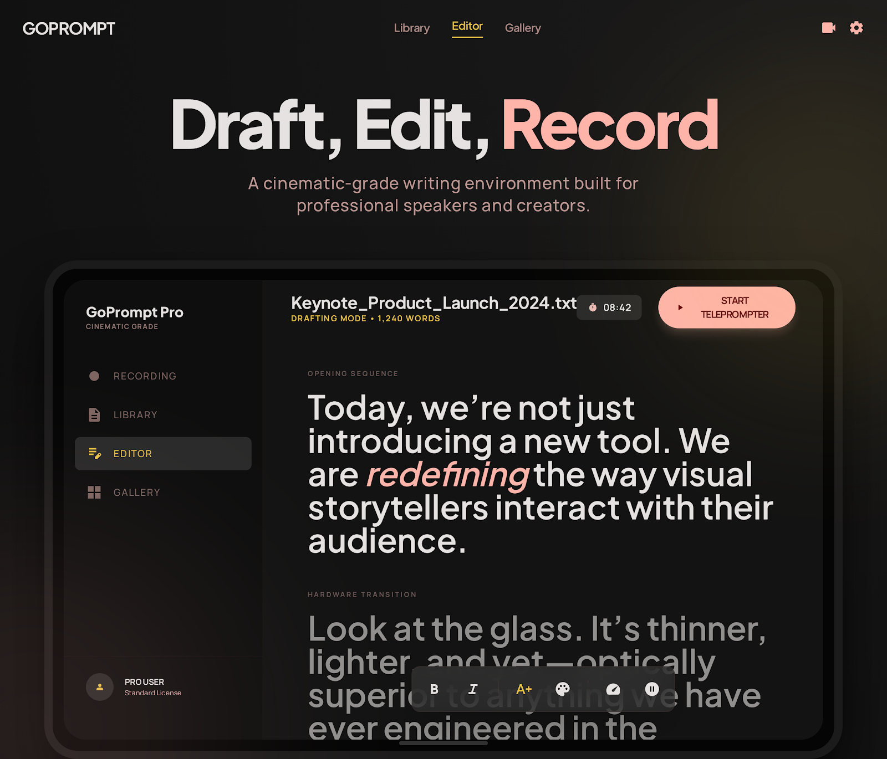
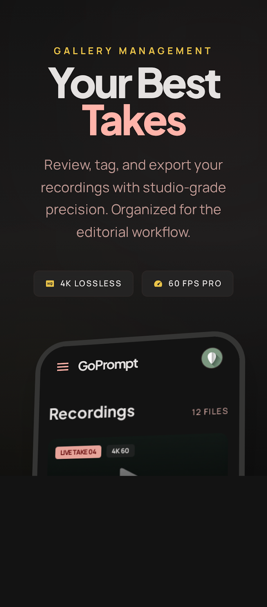
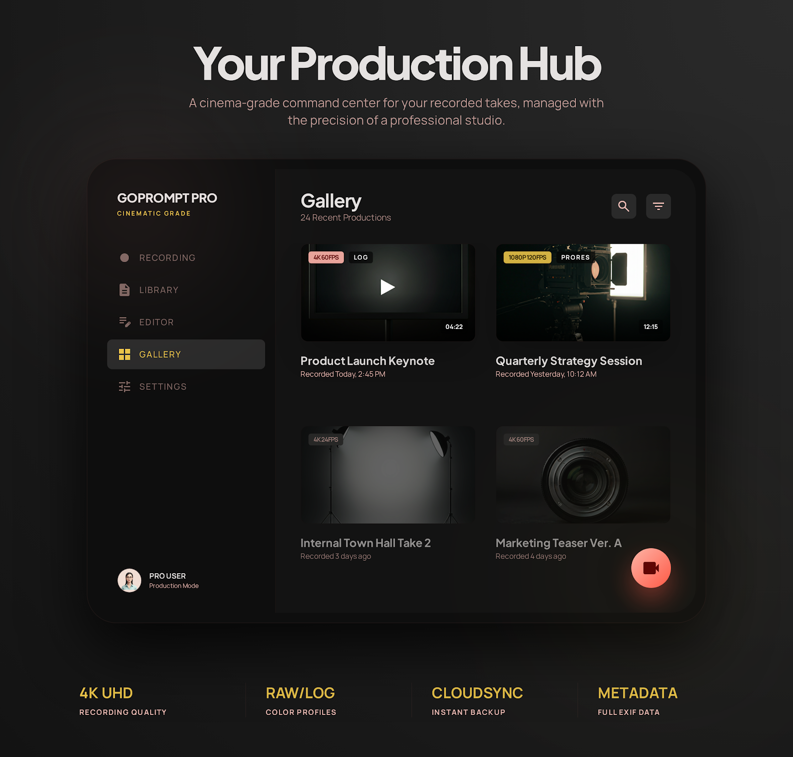
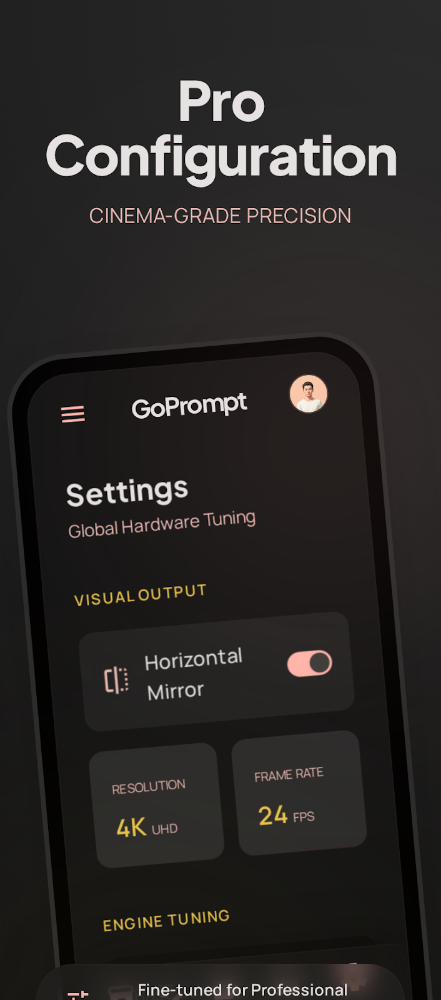
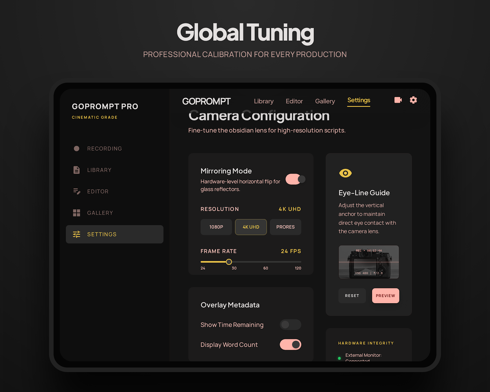

#  GoPrompt: Professional Cinematic Teleprompter

> [!WARNING]
> **PROPRIETARY SOURCE CODE**
> This repository is NOT open-source. It has been made public temporarily and strictly for the purpose of portfolio review and technical evaluation by prospective employers and teams. Any duplication, personal use, or commercial distribution of this codebase without explicit permission is strictly prohibited. See the **Copyright & License** section at the bottom for explicit legal terms.

GoPrompt is a premium iOS Teleprompter application engineered for content creators, broadcasters, and professionals. Designed with a strict focus on **Cinematic Excellence**, it leverages advanced hardware controls, real-time depth processing, and a fluid, physics-based scrolling engine to deliver a seamless and distortion-free recording experience. 

The application is built entirely in **SwiftUI**, integrating deeply with **AVFoundation**, **Metal**, and **CoreML** to provide features typically reserved for high-end studio setups.

---

## 🎨 Design Philosophy: "The Obsidian Lens"

The UI intentionally moves away from a "standard app" aesthetic, embodying **The Obsidian Lens** philosophy. It feels like a high-end piece of optical equipment: 
- **Glassmorphism**: A UI that is virtually invisible until needed, characterized by high-contrast typography floating over deep, translucent glass. 
- **Tonal Depth**: Breaking the template look through intentional negative space and tonal layering, ensuring the speaker’s focus remains strictly on the script.
- **Asymmetric Balance**: Placing controls in ergonomic clusters rather than rigid, centered grids to mimic a professional cinema camera’s viewfinder.

---

## 📸 Application Interface & Functionality

### 1. Recording Studio

| iPhone Showcase | iPad Pro Configuration |
|:---:|:---:|
|  |  |

**Core Purpose:** The primary capture interface optimized for eye contact and cinematic recording.

**Detailed Features:**
- **Eye Contact Preservation Layout:** Mathematically restricts the teleprompter text to the top 15% of the screen (in portrait), guaranteeing the speaker's eyes never drift from the camera hardware.
- **Hardware-Coupled Proximity Tracking:** Automatically forces the teleprompter column to the physical side of the camera lens when rotating between `.landscapeLeft` and `.landscapeRight`.
- **Dynamic Physics Scrolling:** Engine targets 140 WPM with an intelligent 2-second cubic interpolation "ease-in" curve so text accelerates smoothly.
- **Minimalist Recording State:** During an active take, all secondary UI (menus, tabs) is hidden or faded, leaving only a critical Stop button and duration timer.
- **Touch-Override Scrolling:** Users can manually scrub the script vertically during a recording without breaking the scroll engine (auto-scroll resumes exactly from the new touch-release point).
- **Session Guard Protection:** Asynchronous logic ensures audio and video pipelines are completely "hot" before text starts scrolling, preventing ghost recordings.

### 2. Script Library

| iPhone Showcase | iPad Pro Configuration |
|:---:|:---:|
|  |  |

**Core Purpose:** Fast, local access and management of all teleprompter content.

**Detailed Features:**
- **Data-Driven Sorting:** Scripts are automatically organized by their `updatedAt` property, surfacing recently worked-on scripts immediately.
- **Instant Storage Engine:** Powered by an asynchronous `ScriptStorageService` that relies on Codable JSON files stored securely in the app's Documents directory.
- **Quick-Access Actions:** Swipe gestures for deleting scripts and one-tap loading into the Recording Studio.
- **No-Line Typographic Boundaries:** Relies strictly on intentional negative space rather than standard 1px borders for separating items, matching the high-end "Obsidian" aesthetic.

### 3. Rich Text Script Editor

| iPhone Showcase | iPad Pro Configuration |
|:---:|:---:|
|  |  |

**Core Purpose:** A distraction-free environment for writing or pasting lengthy speeches.

**Detailed Features:**
- **Distraction-Free Immersion:** Edge-to-edge typography input designed specifically for writing without interface clutter.
- **Live Metrics Calculation:** Auto-syncs keystrokes in real-time to compute total Word Count.
- **Estimated Duration Engine:** Calculates the exact running time of a script based on the global 140 WPM baseline setting.
- **Immediate Persistence:** Auto-saves progress incrementally so no writing is lost if the app is suddenly closed.

### 4. Recording Gallery

| iPhone Showcase | iPad Pro Configuration |
|:---:|:---:|
|  |  |

**Core Purpose:** Post-capture review and system-level sharing of high-resolution `.mp4` video files.

**Detailed Features:**
- **In-App Playback Overlay:** Quick visual review of active session recordings before exporting them.
- **Hardware-Level Exporting:** Leverages `PHPhotoLibrary` to securely and asynchronously export massive video files into the user's iOS Camera Roll.
- **Deep Clean Protocol:** Implements a strict file-management sequence that instantly deletes temporary `/tmp/` buffer files upon a successful Camera Roll export, keeping the app's footprint minimal.
- **Native Share Sheet Integration:** Direct hooks to iOS sharing (Airdrop, Messages) for fast offloading to editors or team members.

### 5. Settings & Configuration

| iPhone Showcase | iPad Pro Configuration |
|:---:|:---:|
|  |  |

**Core Purpose:** Professional control over the presentation layer and cinematic computational features.

**Detailed Features:**
- **Cinematic Depth Toggle:** Live integration with CoreML (`VNGeneratePersonSegmentationRequest`) to apply computational DSLR-like background blurring.
- **Chroma Key / Green Screen:** Leverages the active ML segmentation mask to drop out backgrounds entirely and replace them with a unified `CIColor.green` screen for post-production.
- **Optical Typography Controls:** Granular sliders to dynamically change Font Size (from 16pt up to 72pt).
- **Beam-Splitter Support ("Mirror Text"):** Instantly flips the X-axis rendering of the script to support physical glass teleprompter mirrors.
- **Active Velocity Manual Override:** Slider that explicitly overrides the WPM-driven automatic scrolling speed.
- **Display Link Frame Rates:** The engine seamlessly shifts from 30 up to 120 FPS based on device capability for zero-jitter scrolling.

---

## 🏗 System Architecture & Engine

GoPrompt relies on a clean, scalable architecture designed specifically to manage heavy rendering threads without impacting the SwiftUI main loop. 

### 1. Dual-Track Preview Strategy
- **`CameraPreviewView`**: Bridged via `UIViewRepresentable` mapping directly to `AVCaptureVideoPreviewLayer` for highly performant, standard low-power rendering.
- **`MetalPreviewView`**: A custom `MTKView` used for computational rendering when applying Real-time Filters, Green Screen, or Cinematic Depth of Field.

### 2. The Teleprompter Engine (`CADisplayLink`)
Instead of relying on SwiftUI's layout cycle for animations (which can lead to dropped frames), GoPrompt utilizes a dedicated `CADisplayLink` engine.
- **Dynamic Physics System**: Automatically calculates baseline velocity using a target of 140 WPM.
- **Ease-in Acceleration**: Employs a **2-second cubic interpolation curve** (`t^2 * (3 - 2t)`) at the start of recordings, ensuring text ramps up to speed smoothly rather than jumping immediately. 
- **MainActor Isolation**: While the hardware pipeline exists on concurrent background threads, the Teleprompter Engine is strictly `@MainActor` isolated to prevent race conditions when shifting `scrollOffset`.

### 3. Source-Time Synchronization (A/V Accuracy)
For Cinematic/Filtered modes requiring `AVAssetWriter`, the app manually captures raw video and audio streams. 
- **The "Uptime Gap" Solution**: GoPrompt uses the exact `presentationTime` of the *very first* video frame received to initialize the muxing session. This completely avoids iOS audio drift or silent playback bugs common when mixing real-time ML processing with raw microphone input.

### 4. Hardware Session Guard Pattern
To eliminate the critical failure state of "Ghost Recordings" (scrolling without saving), the app wraps captures in asynchronous verifiers:
- Asynchronous `cameraService.isSessionRunning` checks block the Teleprompter initialization until the Capture Session is fully warmed up and active.

### 5. Architectural Animation Isolation
Layout updates during recording (like toggling specific settings) are structurally separated into **Layer 1** (Background / Camera Feed) and **Layer 2** (Foreground Floating Controls). This completely isolates the heavy Metal preview frames from SwiftUI state invalidation, preserving battery life and thermal headroom.

---

## 🛠 Tech Stack

- **UI Framework:** SwiftUI, UIKit (for specialized hosting)
- **Audio/Video Pipeline:** AVFoundation (`AVCaptureSession`, `AVAssetWriter`)
- **Computer Vision:** CoreML (`VNGeneratePersonSegmentationRequest` for cinematic depth extraction)
- **High-Performance Rendering:** Core Image, Metal (`MTKView`)
- **App Data & Persistence:** Codable JSON state managed via `ScriptStorageService`
- **Design Mockups:** Stitch Design System

## 🚀 Quick Run Guide

To run the project locally, ensure you have the required development environment:

1. Clone the repository.
2. Open `TeleprompterApp.xcodeproj` in Xcode 16+.
3. Select an active iOS Device (Simulator does not support the full AV camera suite).
4. Build and Run (`Cmd + R`).

*Note: For Fastlane deployment and App Store metadata management, reference the `fastlane/` directory.*

---

## ⚖️ Copyright & License (PROPRIETARY)

**© 2026 Suleman Imdad. All Rights Reserved.**

**THIS IS NOT AN OPEN-SOURCE PROJECT.** 

This repository and its contents have been temporarily made public **strictly for the purpose of portfolio review and technical evaluation** by prospective employers, teams, or clients. 

You are granted **read-only access** to view the source code. You are explicitly **prohibited** from:
- Copying, duplicating, or cloning this codebase for personal or commercial use.
- Modifying, distributing, or publishing any part of this software.
- Using any components, UI paradigms, or architectural patterns described herein in your own projects.
- Submitting this application or any derivative works to the Apple App Store or any other distribution platform.

Any unauthorized use, reproduction, or distribution of this code will be subject to strict legal action under intellectual property and copyright laws. 
